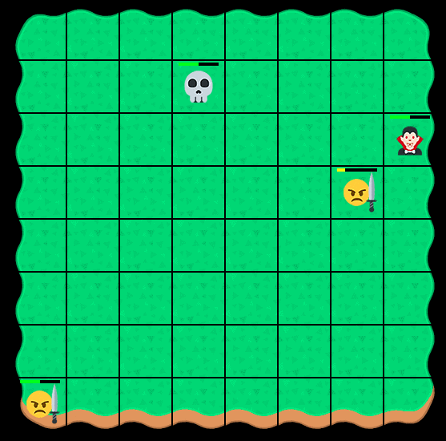

# Retro Game.
### Дипломный проект по курсу "Продвинутый Javascript" (Нетология).

Ссылка на опубликованный [проект](https://queenarizona.github.io/Retro-Game/).

Главная задача: на основе написанного заранее UI и спроектированных базовых классов, достроить проект по разработке небольшой пошаговой игры, перевести его на работу с npm, Babel, Webpack, ESLint и дописать оставшуюся функциональность.

## Концепция игры

Двухмерная игра в стиле фэнтези, где игроку предстоит выставлять своих персонажей против персонажей нечисти. После каждого раунда, восстанавливается жизнь уцелевших персонажей игрока и повышается их уровень. Максимальный уровень - 4.


## Выполненные задачи:
* Дописаны функции отрисовки игрового поля и его границ.
* Добавлены классы персонажей, унаследованные от базового, с необходимыми наборами характеристик (атака, защита, дальность атаки и перемещения), реализован запрет на создание персонажей с помощью конструктора базового класса.
* Реализована логика генерации персонажей в крайних столбцах поля в зависимости от принадлежности к команде.
* Добавлен вывод информации о персонаже с помощью всплывающей подсказки при наведении курсора на персонаж.

* Реализован визуальный отклик на действия игрока с курсором мыши (возможность выбрать другого персонажа, перейти на другую клетку, атаковать противника или недопустимость первых трех действий).

* Добавлен алгоритм перемещений персонажей по полю, атаки и нанесения урона, реализована стратегия ответных действий компьютера.
* Написаны основные функции для игровой механики: переходов на новый уровень, прокачки персонажей, завершения и загрузки новой игры.
* Реализовано хранение состояния и загрузка игры при помощи localStorage.
* Написаны авто-тесты на основные реализованные функции.

Для установки зависимостей и запуска проекта локально используются команды npm:

```sh
$ npm install
$ npm run start
```
